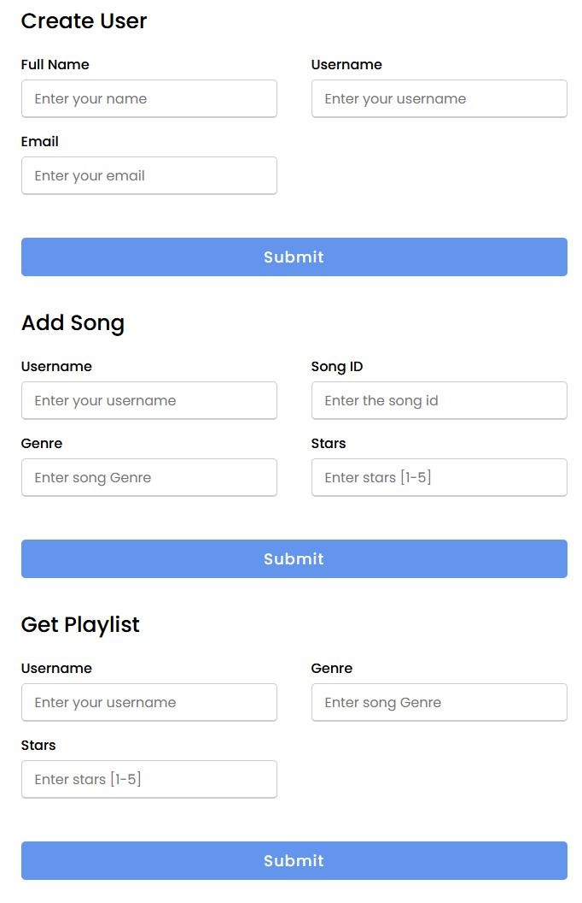

# AWS Serverless YouTube Playlist Builder
  ## Video
  [Video](https://youtu.be/5hYMTKk2w0U)
  ## Description
  AWS Serverless app using DynamoDB <-> Lambda <-> API Gateway <-> Client App (html, js, css)

  Save users, user songs and generate youtube playlists without logging into youtube

  

  ## AWS Services
  ```
  DynamoDB Table
    Primary Key Name = PK [note: not Pk, not pK, not pk, but PK]
    Sort Key Name = SK [note: reverse engineer line above]

    Index
    Name = GSI1
    Primary Key Name = Stars
    Sort Key Name = SK

 Lambda

 API Gateway
 ```